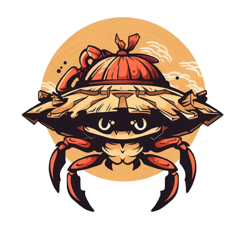

<!-- markdownlint-disable -->
<div align="center">
  <h1> Gomu Gomu no Gatling </h1>
  
</div>
<br />
<!-- markdownlint-restore -->

[](https://github.com/keep-starknet-strange/gomu-gomu-no-gatling/actions/workflows/push.yml)
[](LICENSE)
[](https://github.com/keep-starknet-strange/gomu-gomu-no-gatling/issues?q=is%3Aissue+is%3Aopen+label%3A%22help+wanted%22)
[](https://docs.rs/gatling)
[](https://crates.io/crates/gatling)

[![Exploration_Team](https://img.shields.io/badge/Exploration_Team-29296E.svg?&style=for-the-badge&logo=data:image/svg%2bxml;base64,PD94bWwgdmVyc2lvbj0iMS4wIiBlbmNvZGluZz0iVVRGLTgiPz48c3ZnIGlkPSJhIiB4bWxucz0iaHR0cDovL3d3dy53My5vcmcvMjAwMC9zdmciIHZpZXdCb3g9IjAgMCAxODEgMTgxIj48ZGVmcz48c3R5bGU+LmJ7ZmlsbDojZmZmO308L3N0eWxlPjwvZGVmcz48cGF0aCBjbGFzcz0iYiIgZD0iTTE3Ni43Niw4OC4xOGwtMzYtMzcuNDNjLTEuMzMtMS40OC0zLjQxLTIuMDQtNS4zMS0xLjQybC0xMC42MiwyLjk4LTEyLjk1LDMuNjNoLjc4YzUuMTQtNC41Nyw5LjktOS41NSwxNC4yNS0xNC44OSwxLjY4LTEuNjgsMS44MS0yLjcyLDAtNC4yN0w5Mi40NSwuNzZxLTEuOTQtMS4wNC00LjAxLC4xM2MtMTIuMDQsMTIuNDMtMjMuODMsMjQuNzQtMzYsMzcuNjktMS4yLDEuNDUtMS41LDMuNDQtLjc4LDUuMThsNC4yNywxNi41OGMwLDIuNzIsMS40Miw1LjU3LDIuMDcsOC4yOS00LjczLTUuNjEtOS43NC0xMC45Ny0xNS4wMi0xNi4wNi0xLjY4LTEuODEtMi41OS0xLjgxLTQuNCwwTDQuMzksODguMDVjLTEuNjgsMi4zMy0xLjgxLDIuMzMsMCw0LjUzbDM1Ljg3LDM3LjNjMS4zNiwxLjUzLDMuNSwyLjEsNS40NCwxLjQybDExLjQtMy4xMSwxMi45NS0zLjYzdi45MWMtNS4yOSw0LjE3LTEwLjIyLDguNzYtMTQuNzYsMTMuNzNxLTMuNjMsMi45OC0uNzgsNS4zMWwzMy40MSwzNC44NGMyLjIsMi4yLDIuOTgsMi4yLDUuMTgsMGwzNS40OC0zNy4xN2MxLjU5LTEuMzgsMi4xNi0zLjYsMS40Mi01LjU3LTEuNjgtNi4wOS0zLjI0LTEyLjMtNC43OS0xOC4zOS0uNzQtMi4yNy0xLjIyLTQuNjItMS40Mi02Ljk5LDQuMyw1LjkzLDkuMDcsMTEuNTIsMTQuMjUsMTYuNzEsMS42OCwxLjY4LDIuNzIsMS42OCw0LjQsMGwzNC4zMi0zNS43NHExLjU1LTEuODEsMC00LjAxWm0tNzIuMjYsMTUuMTVjLTMuMTEtLjc4LTYuMDktMS41NS05LjE5LTIuNTktMS43OC0uMzQtMy42MSwuMy00Ljc5LDEuNjhsLTEyLjk1LDEzLjg2Yy0uNzYsLjg1LTEuNDUsMS43Ni0yLjA3LDIuNzJoLS42NWMxLjMtNS4zMSwyLjcyLTEwLjYyLDQuMDEtMTUuOGwxLjY4LTYuNzNjLjg0LTIuMTgsLjE1LTQuNjUtMS42OC02LjA5bC0xMi45NS0xNC4xMmMtLjY0LS40NS0xLjE0LTEuMDgtMS40Mi0xLjgxbDE5LjA0LDUuMTgsMi41OSwuNzhjMi4wNCwuNzYsNC4zMywuMTQsNS43LTEuNTVsMTIuOTUtMTQuMzhzLjc4LTEuMDQsMS42OC0xLjE3Yy0xLjgxLDYuNi0yLjk4LDE0LjEyLTUuNDQsMjAuNDYtMS4wOCwyLjk2LS4wOCw2LjI4LDIuNDYsOC4xNiw0LjI3LDQuMTQsOC4yOSw4LjU1LDEyLjk1LDEyLjk1LDAsMCwxLjMsLjkxLDEuNDIsMi4wN2wtMTMuMzQtMy42M1oiLz48L3N2Zz4=)](https://github.com/keep-starknet-strange)

Blazing fast tool to benchmark Starknet sequencers 🦀.

## Installation

### From source

```bash
git clone https://github.com/keep-starknet-strange/gomu-gomu-no-gatling
cd gomu-gomu-no-gatling
cargo install --path .
```

### From crates.io

```bash
cargo install --locked gatling
```

### Run debug

```bash
RUST_LOG=debug cargo run -- shoot -c config/default.yaml
```

## Usage

```bash
gatling --help
```

For Katana, currently you need to increase the `DEFAULT_PREFUNDED_ACCOUNT_BALANCE` in constants to `0xffffffffffffffffffffffffffffffff`
and run the node with flag `--no-validate`.

### Configuration

Gomu gomu's configuration is specified as a yaml file.
You can find example configurations under the [config](./config) folder.

> As it uses the `config` crate under the hood, the configuration could be specified as any other file type such as TOML or JSON.

The configuration is defined by the following spec

- `rpc`

  - `url`: Starknet RPC url, should be compliant with the specification

- `setup`

> `v0` and `v1` CAN'T be specified at the same time

- `erc20_contract`: ERC20 contract used to benchmark transfers

  - `v0`: Path to Cairo Zero contract artifact
  - `v1`:

    - `path`: Path to Cairo contract sierra artifact
    - `casm_path`: Path to Cairo contract casm artifact

  - `erc721_contract`: ERC721 contract used to benchmark mints
    ...

  - `account_contract`: Account contract used to send transactions
    ...

  - `fee_token_address`: Contract address of the fee token on the target chain
  - `num_accounts`: Number of accounts sending transactions

- `run`

  - `num_erc20_transfers`: Number of ERC20 `transfer` transactions
  - `num_erc721_mints`: Number of ERC721 `mint` transactions
  - `concurrency`: How many transactions to do simultaneously

- `report`

  - `num_blocks`: Number of last blocks to take into account in the report
  - `output_location`: Path to the file where to save the reports

- `deployer`

  - `salt`: Salt used to compute deployment addresses
  - `address`: Address of the deployer account (should be pre-funded)
  - `signing_key`: Private key of the deployer signer

### Run a load test

```bash
gatling shoot -c config/default.yaml
```

### Output

The main output of gomu gomu is the report output location specified in specified in the configuration file.

At the end of all benchmarks gomu gomu will collect the results into a single json file with the following structure:

- `users`: The amount of goose users used to do the benchmarks, changed by `concurrency`

- `all_bench_report`: A report over all benchmarks done, has a portion of metrics that `benches` has

- `benches`: A array of reports for all benchmarks

  - `name`: The name of the benchmark
  - `amount`: How many times this benchmark was ran
  - `metrics`: Metrics over the whole benchmark

    - `name`: The name of the metric
    - `unit`: The unit of the metric, empty when there is no unit
    - `value`: The metrics value, a number

      - For floats, `Infinite` and `NaN` are not JSON numbers and thus will be turned into `null`
      - Values gotten from submission time are calculated from the latency to add a new transaction to the node
      - Values gotten from verification time are calculated from the latency to get the transaction receipt after the transactions have been processed

  - `last_x_blocks_metrics`: Metrics over the last blocks of the benchmark

    - `num_blocks`: The amount of last transactions that were measured
    - `metrics`: An array of metrics

- `extra`: Extra information for this run

Gomu gomu will also display into the console information about each step in the benchmark.

## Resources

- Gomu Gomu is originally inspired from [Flood](https://github.com/paradigmxyz/flood)
- (Aptos load-testing tool)[https://github.com/aptos-labs/aptos-multi-region-bench]
- (Starknet RPC specs)[https://github.com/starkware-libs/starknet-specs/blob/master/api/starknet_api_openrpc.json]

## Contributors

<!-- ALL-CONTRIBUTORS-LIST:START - Do not remove or modify this section -->
<!-- prettier-ignore-start -->
<!-- markdownlint-disable -->
<table>
  <tbody>
    <tr>
      <td align="center" valign="top" width="14.28%"><a href="https://github.com/abdelhamidbakhta"><br /><sub><b>Abdel @ StarkWare </b></sub></a><br /><a href="https://github.com/keep-starknet-strange/gomu-gomu-no-gatling/commits?author=abdelhamidbakhta" title="Code">💻</a></td>
      <td align="center" valign="top" width="14.28%"><a href="https://github.com/EvolveArt"><br /><sub><b>0xevolve</b></sub></a><br /><a href="https://github.com/keep-starknet-strange/gomu-gomu-no-gatling/commits?author=EvolveArt" title="Code">💻</a></td>
      <td align="center" valign="top" width="14.28%"><a href="https://droak.sh/"><br /><sub><b>Oak</b></sub></a><br /><a href="https://github.com/keep-starknet-strange/gomu-gomu-no-gatling/commits?author=d-roak" title="Code">💻</a></td>
      <td align="center" valign="top" width="14.28%"><a href="https://github.com/drspacemn"><br /><sub><b>drspacemn</b></sub></a><br /><a href="https://github.com/keep-starknet-strange/gomu-gomu-no-gatling/commits?author=drspacemn" title="Code">💻</a></td>
      <td align="center" valign="top" width="14.28%"><a href="https://github.com/haroune-mohammedi"><br /><sub><b>Haroune &#124; Quadratic</b></sub></a><br /><a href="https://github.com/keep-starknet-strange/gomu-gomu-no-gatling/commits?author=haroune-mohammedi" title="Code">💻</a></td>
      <td align="center" valign="top" width="14.28%"><a href="https://github.com/dbejarano820"><br /><sub><b>Daniel Bejarano</b></sub></a><br /><a href="https://github.com/keep-starknet-strange/gomu-gomu-no-gatling/commits?author=dbejarano820" title="Code">💻</a></td>
      <td align="center" valign="top" width="14.28%"><a href="https://github.com/nicbaz"><br /><sub><b>nbz</b></sub></a><br /><a href="https://github.com/keep-starknet-strange/gomu-gomu-no-gatling/commits?author=nicbaz" title="Code">💻</a></td>
    </tr>
  </tbody>
</table>

<!-- markdownlint-restore -->
<!-- prettier-ignore-end -->

<!-- ALL-CONTRIBUTORS-LIST:END -->
